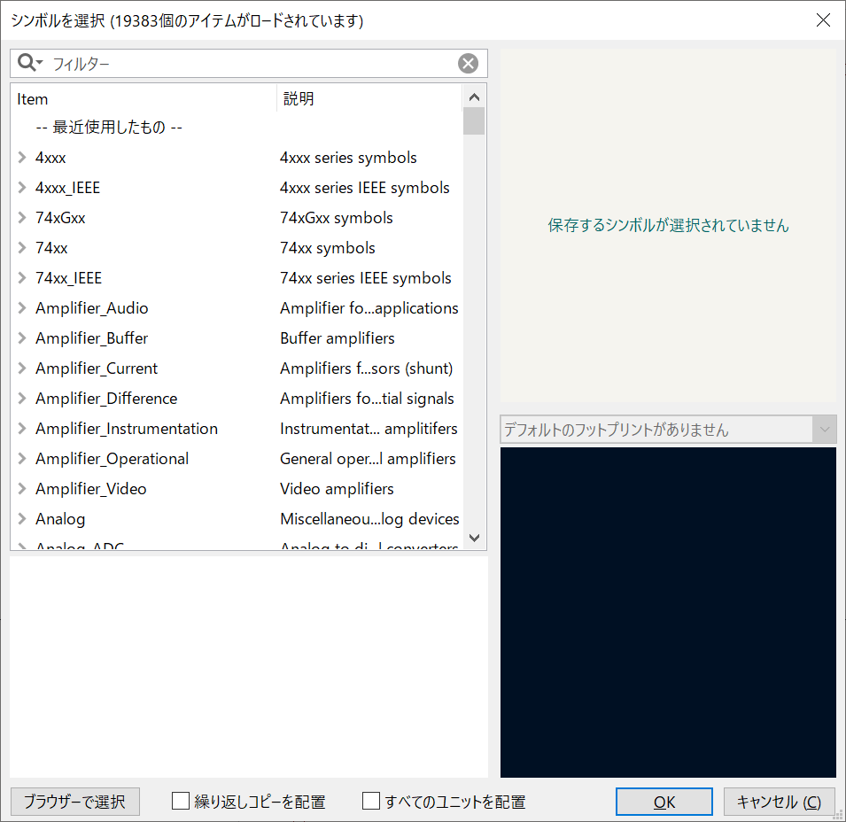
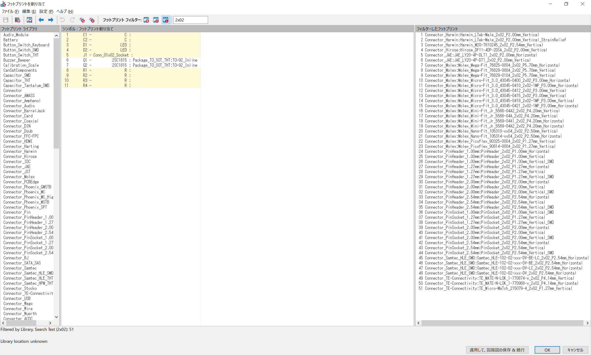

# KiCAD 事始め

## 目次

- [注意点](#注意点)
- [ダウンロードとインストール](#ダウンロードとインストール)
- [プロジェクトの作成](#プロジェクトの作成)
- [回路図の作成](#回路図の作成)
  - [部品（シンボル）の配置](#部品シンボルの配置)
  - [配線](#配線)
- [フットプリントの割り当て](#フットプリントの割り当て)
- [基板設計](#基板設計)
  - [基板エディタの起動と読み込み](#基板エディタの起動と読み込み)
  - [部品の配置](#部品の配置)
  - [3D ビューワで見てみる](#3d-ビューワで見てみる)
- [製造データのエクスポート](#製造データのエクスポート)

## 注意点

言語設定次第では英語だったり日本語だったりしますが、そこは適宜読み替えていってください

## ダウンロードとインストール

[KiCAD.org/download/](https://www.kicad.org/download/) のページから自分の環境を選択し（ほとんどの場合 Windows）、「Stable Release」の項目にある「GitHub」をクリックするとインストーラがダウンロードされます。[ここ](https://github.com/KiCad/kicad-source-mirror/releases/download/7.0.6/kicad-7.0.6-x86_64.exe) をクリックすると本稿執筆時点での最新版である Ver 7.0.6 のインストーラをダウンロードできます

<div align="center"></div>

インストーラをダウンロードできたらダブルクリックして起動し、画面の指示に従ってインストールを進めます

<div align="center"></div>
<div align="center"></div>
<div align="center"></div>
<div align="center"></div>
<div align="center"></div>

するとデスクトップにショートカットが生成されるので、それをダブルクリックします

<div align="center"></div>

このようなウインドウが表示されればインストール完了です

<div align="center"></div>

おそらくよく使うようになると思うので、タスクバーにピン留めしておくことをオススメします

## プロジェクトの作成

[Ctrl] + [N] キーを押すか、画面右側のバーの一番上のアイコンをクリックして新しいプロジェクトを作成します

<div align="center"></div>

するとエクスプローラが立ち上がるので、プロジェクトを保存したいところまで移動し、名前を付けて [保存(S)] を押します  
ここでは [D:/I.Sys/] に [sample_project] として保存します

もし、「このプロジェクト用に新しいフォルダを作成」にチェックが入っていない場合は入れておいて下さい

<div align="center"></div>

すると、このようになります。いくつかファイルが作成されていることが分かりますね

<div align="center"></div>

## 回路図の作成

「回路図エディター」のアイコンをクリックして起動します。新しいウィンドウが立ち上がります

<div align="center"></div>
<div align="center"></div>

ここに回路図を書いていきます。以降、非安定マルチバイブレータの作成を例に、操作方法を記述します  
本ドキュメントに倣い同じ操作で同じようなものを作ってみて下さい。操作に慣れる練習になります

ちなみに、非安定マルチバイブレータの回路図はこれです。これの基板を作成することが目標になります  
アノテーション（素子についてる番号; R1 など）まで再現する必要はありません

<div align="center"></div>

### 部品（シンボル）の配置

実際にシンボルを配置する前に、どの部品が何個・何種類必要なのかを把握しておくとよいです。今回の場合はトランジスタ 2 つ、抵抗 4 つ、コンデンサ 2 つ、LED 2 つ、電源用コネクタ 1 つ（2 Pin）です

ウィンドウの右側にならんでいるアイコンの、上から 3 番目をクリックするか、[A] を押します

<div align="center"></div>

すると、ロードが始まり、こんなウィンドウが表示されます

<div align="center"></div>

まずはトランジスタから配置しましょう。検索窓にトランジスタの種類である「2sc」と打つと「2SC1815」が出てくるのでそれをダブルクリックまたは [Enter] で選択しましょう

<div align="center"></div>

上の窓がシンボル、下の窓がフットプリントになります。フットプリントはあとから変更できるので今は気にしなくても大丈夫です

2 つ使うのでシンボルを任意の場所に配置した後に範囲選択でシンボルを選択してコピペします。やり方は普通に [Ctrl] + [C], [Ctrl] + [V] で OK

このような画面になっていると思います（十字線はカーソルですので気にしなくて大丈夫です）

<div align="center"></div>

同じ要領で抵抗（r と打つと出てきます）とコンデンサ（c）、LED （led）、2 Pin のコネクタ（1x02）を配置して必要数までコピペします

するとこうなるでしょう  
（全体が見えやすくなるように拡大しました）

<div align="center"></div>

```info
拡大・上下左右の移動の操作はマウスホイールとショートカットキーでできます

拡大：マウスホイール
上下：Shift + マウスホイール
左右：Ctrl + マウスホイール
```

配置はこれで終わりではありません。ここから向きを調整します  
向きの調整の方法はシンボルを選択した状態で [R] キーを押すことで回転が、X, Y キーで X 軸, Y 軸中心の反転が可能です

向きの調整と配置の微調整ができました。同じような画面になっていますか？

<div align="center"></div>

これでシンボルの配置が完了です

次に配置するのは電源関係のシンボルです。右のバーに並んでいるアイコンの、上から 4 番目をクリックするか、[P] を押します

<div align="center"></div>

すると、このようなウィンドウが立ち上がります

<div align="center"></div>

検索窓に「vcc」, 「gnd」, 「pwr」それぞれを入力して出てきたものを以下のように配置します


<div align="center"></div>

これで電源関係のシンボルを配置できました。一応、それぞれのシンボルの意味を以下に示します

```info
VCC：正側（正確にはトランジスタのコレクタ側）の電源
GND：文字通り GND, GNDA はアナログ回路用の GND など様々な種類があるが基本気にしなくて良い
PWR_FLAG：パワーフラグと読み、パワーソース、つまり電源が接続される箇所であることを明示するためのシンボル
```

### 配線

ここからは先程配置したシンボル同士を繋げる配線を引いていきます  
配線を引くには右のバーに並んでいるアイコンの、上から 5 番目をクリックするか、[W] を押します

<div align="center"></div>

シンボルから生えている線の先端の小さな円をクリックすると、そこから線を引くことができます。線の反対側になるシンボルまで線を引き、同じく線の先端の小さな円をクリックすると終了できます。引いている途中で終わらせたい場合は [K] です。[ESC] を押すと配線をキャンセルできます

すべての線を引くとこのようになると思います  
線を途中で 90 ° 曲げたいときは曲げたいところでクリックしましょう

<div align="center"></div>

ここで、VCC や GND などの電源シンボルを接続しているところは、同じシンボル同士であれば配線で接続されているのと同義であるため、配線を引く必要はありません

これで、回路図の完成です

## フットプリントの割り当て

ここでは、各シンボルにフットプリントを割り当てていきます。フットプリントとは、実際に部品を実装するためのランドやパッド、シルク印刷のまとまりのことです

上に並んだアイコンの、右から 5 番目をクリックします

<div align="center"></div>

すると、新しくウィンドウが立ち上がります

<div align="center"></div>

黄色く網掛けされているところが未割り当てのシンボルです。実際に使用する部品に合うものを割り当てていきます

例としてまずはコンデンサにフットプリントを割り当てます

①：フットプリントライブラリを選択

左にズラっと並んでいるライブラリの中から、コンデンサ関連のものを選択します  
今回の場合、「Capacitor_THT」になります。THT はスルーホール実装の部品であることを意味します

<div align="center"></div>

右に並ぶフットプリント一覧がコンデンサ（Capacitor）だけになったと思います

②：フットプリントの絞り込み

上部の検索窓に「CP」と入力します。これは電解コンデンサを意味します

右のフットプリント一覧をよく見ると「Axial」と「Radial」の二種類に大別できることが分かります。それぞれアキシャルリード, ラディアルリードを意味し、アキシャルリードは一般的なカーボン抵抗のように部品から生えている導線が同一直線上に並ぶもので、ラディアルリードは部品の同じ面から並行に導線が生えているものになります  
大体のコンデンサはラディアルリードなので検索窓に「Radial」も加えてみましょう

<div align="center"></div>

ここまで来たところで、実際に使う部品について調べます。そういえば部品定数を出していませんでしたが、正直なところなんでもいいので仮に 10 uF とします

秋月電子のサイトで 10 uF の電解コンデンサを調べてみると、おそらくこの商品がヒットすると思います  
[P-17897](https://akizukidenshi.com/catalog/g/gP-17897/)

<div align="center"></div>

この部品のデータシートを見ると以下の情報が分かります

<div align="center"></div>

まず、データシート 2 枚目の表から、10 uF 50 V に該当するマスを見ると ΦD x L = 5 x 11 mm であることが見て取れます。これらの数字が何を意味するかはデータシート 1 枚目の寸法図を見ます

<div align="center"></div>

ΦD はコンデンサ本体の直径、L は高さのようです  
寸法図内の対応表から、ΦD が 5 mm のときのリード線の直径 Φd は 0.5 mm であり、リード線間の距離 F は 2.0 mm と分かりますね

以上の情報をもとに、適するフットプリントを探します

必要な情報とそれぞれの値を整理すると、以下の表になります

| データシートでの表記 | KiCAD フットプリントでの表記 | 値 |
|:----:|:----:|:----:|
| ΦD | D | 5 mm |
| F | P | 2.0 mm |
| Φd | - | 0.5 mm |
| L | - | 11 mm |

ここで、「-」とした箇所は表記がない（必要でない）情報です

ここで問題です。これらの情報から、最適なフットプリントはどれでしょうか

正解はこれです

<div align="center"></div>

この操作をすべての部品で行っていくわけです。大変ですね

なので、例えば抵抗やコンデンサで表面実装部品を使用する場合、全て 0603-1608M で統一するなどの工夫をすると良いと思います

ここまでの手順で最適なフットプリントがわかったのでそれを割り当てます

先程のフットプリント割り当ての画面を開き、「C」をすべて選択します  
その状態で、先程のフットプリントをダブルクリックします。そうするとフットプリントが割り当てられます。黄色の網掛けがなくなっていますね

<div align="center"></div>

同様の手順でフットプリントを探して割り当てていきます。結論を言ってしまうと、残る LED と抵抗、電源コネクタのフットプリントは以下のものを選択します

<div align="center"></div>
<div align="center"></div>

割り当てが終わったら [OK] を押して終了します

これにてフットプリントの割り当ては終わりです。お疲れ様

## 基板設計

ここからは実際に基板を設計します

### 基板エディタの起動と読み込み

上に並んだアイコンの、右から 2 番目をクリックします  
すると新たなウィンドウ「PCB Editor」が起動します

<div align="center"></div>
<div align="center"></div>

そして、上に並んだアイコンの、右から 5 番目をクリックします

<div align="center"></div>

すると、また新たなウインドウが立ち上がります

<div align="center"></div>

[Update PCB] -> [Close] と押すと、先程割り当てたフットプリントが現れます

こちらの画面を使って基板を設計していきます

### 部品の配置

現れた部品をとりあえず中央に配置しました。これらを配線しやすい位置（今回の場合はおおよそ回路図通りの位置）に並び替えます

<div align="center"></div>

画面を複数使える場合は左右にウィンドウを並べて作業すると良いでしょう。すごく捗りますよ

<div align="center"></div>

実際に配置をする前に、Grid の値を変えておきましょう  
今回のような簡単な回路の場合はユニバーサル基板と同じ 2.54 mm とするといいでしょう

<div align="center"></div>

配置だけ済ませました。配置は回路図そのままです

<div align="center"></div>

部品同士がぶつかっていなければ問題ありません

### 配線

回路図の作成のときとはことなり、基板の配線にはレイヤーが存在します。具体的には表面（F.Cu）と裏面（B.Cu）です。これらを必要に応じて使い分けたり、後述する via（ビア）で繋いだりして基板を作っていきます

ここでは、作る回路がとてもシンプルなので基本的に表面（F.Cu）を使って配線をすることとします

注意点①：配線の太さ  
回路によってはたくさん電流が流れる場合があります。主に電源やモータなどの負荷に接続される線です。これらは、1 A あたり 1 mm の幅を目安に、配線の太さも適宜変えながら配線していく必要があります。今回は大した電流は流れないため、デフォルトのままで進めて大丈夫です

注意点②：配線の通し方  
配線は可能な限り最短経路を通る直線で結ぶのが理想ですが、現実はそう甘くないため、周辺の部品などの様子を見ながらいい感じのところをいい感じに通す必要があります。とても言語化するのが難しいため、いろんな基板を設計しながら慣れて下さい。そのうち分かるようになります  
基本的には見た目が整っていれば良しとされています

以上の注意点を踏まえながら、実際に配線をしていきます。配線をするには右に並んでいるアイコンの上から 4 番目をクリックするか、[X]を押します

<div align="center"></div>

表面だけで配線できるところを配線するとこのようになります

<div align="center"></div>

C1 - Q2, C2 - Q1 を接続するところ以外は配線できました。これ以上は配線できないため、裏面に配線を通します

C1 - Q2 の線と C2 - Q1 の真ん中以外を通すとこうなります

<div align="center"></div>

ここは配線がクロスするため、一方は表、他方は裏に通す必要がありますが、両方とも裏面なため、途中まで引いた線を表に持ってきます。そのために via を打ち、表の層と接続します。この via と via を接続するように表に線を通します

<div align="center"></div>

### 基板外形の作成

最後のステップ、外形作成です  
今回のはシンプルな基板なので、ちょうど収まる長方形にしましょう

矩形描画ツールを使います。場所はここです

<div align="center"></div>

レイヤは「Edge.Cuts」を使用します。これにすることで、基板製造業者にここが基板外形であることを伝えることができます

適当に囲ってあげましょう

<div align="center"></div>

これで基板設計は完了です。お疲れ様

### 3D ビューワで見てみる

PCB Editor を開いた状態で [Alt] + [3] を押すと 3D ビューワを表示させることができます。これで作った基板を眺めてみましょう

<div align="center"></div>

## 製造データのエクスポート

実際に基板を注文する際はガーバーデータと呼ばれる製造データを作る必要があります  
実際に注文するかはおまかせしますが、エクスポートをやってみましょう

[File] -> [Plot...] を選択すると、このようなウィンドウが立ち上がります

<div align="center"></div>

「Output directory:」の右の欄の更に右の Explorer のようなアイコンをクリックし、立ち上がったエクスプローラの開いているところで右クリックをして新しいフォルダを作成します。名前は「PCB」のように分かりやすいものにしておきましょう  
そして作成したフォルダをクリックして「フォルダーの選択」をクリックします。何か聞かれるので「はい(Y)」を押します（これは今いる絶対パスを使いますか？　みたいな質問です）

そしてウィンドウ右下の [Plot] と [Generate Drill Files...] を押して各種ファイルを生成し [Close] します

エクスプローラを新たに立ち上げて保存しているフォルダまで移動し、先程作ったフォルダを ZIP 化します。これで完成です

実際に注文する際の手順についてはまたの機会にするということでこの場では省略します

この文章の内容は以上です

<div align="right">作成者：北川幸輝</div>
