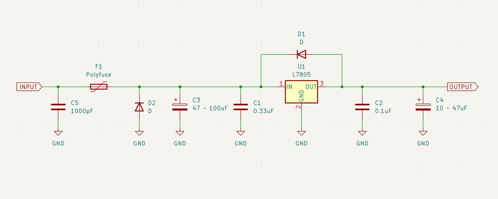
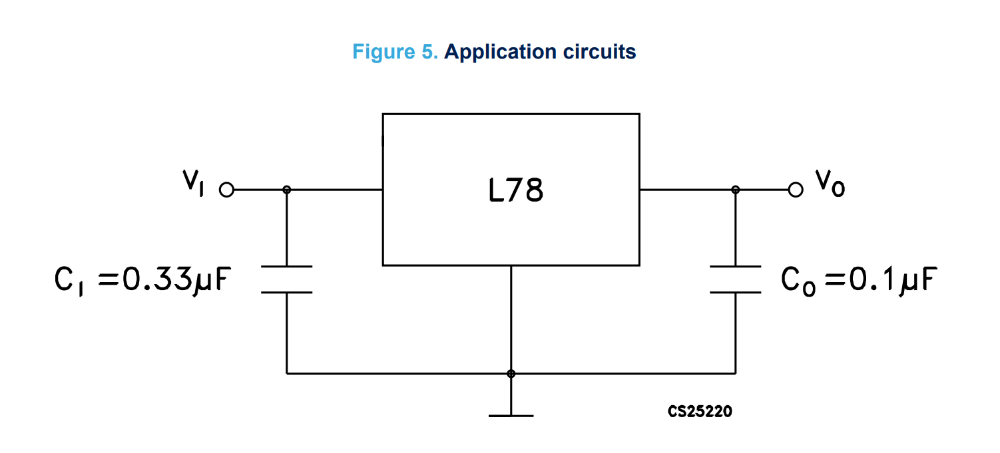

# 78xx の使い方

ここでは，より安全性・安定性が高い，真面目な回路設計というものをしていきます

今回取り上げるのは，簡単に使えて便利な定電圧レギュレータである 78xx シリーズを使った定電圧電源回路です．ちなみに，xx のところには出力電圧を表す数字が入ります．例として 5V であれば 05 など

# 回路

最終的に作る回路はこちら

# 解説

ここからは，各素子の役割について解説していきます

## C1, C2

C1 は入力キャパシタとも呼ばれ，ボルテージレギュレータの発振防止を目的としています  
C1 を付けなかった場合や容量が足りない場合，ボルテージレギュレータは発振してしまいます

C2 はレギュレータ内部のエラーアンプの位相補償用です  
C2 を付けなかった場合や容量が足りない場合，動作が不安定になり，これまた発振する可能性が高くなります

この容量は，NJM7805 のデータシートに記載があるものをそのまま使って構いません

配置・配線する際は，可能な限りレギュレータの端子の近くに配置し，可能な限り太く短く配線を通してください

これらのコンデンサは，レギュレータの安定動作に影響します．この安定動作には，コンデンサの ESR（等価直列抵抗）も関係してきますので，なるべく ESR の低い，積層セラミックコンデンサを使いましょう．MLCC と呼ばれるものです

## C3, C4

C3 は電源のノイズ除去と平滑を目的としています．C4 は出力電圧リプルの除去と過渡応答特性の改善が目的です  
どちらもある程度の容量のコンデンサを付けると電圧が滑らかになります  
また，負荷電力の急激な変化への応答（過渡応答）が良くなります

容量については，必ず C3 > C4 となるようにしてください．負荷電力に応じて，C3:47uF，C4:10uF や C3:100uF，C4:47uF などとしましょう  
これは電源オフ時の電圧差による，電流の逆流破壊防止のためです

## D1

これはより安全性を高めるための措置で，万が一出力側の方が高電位となった際に，電流を逃がすためのものです  
いくら電源回路側で入力の方の容量を大きくして対策しても，負荷側に大きな容量があったり，誘導負荷（モータなど）による逆起電力が発生したりして，出力側の方が電位が上がってしまうということは起こり得ます  
その結果レギュレータが故障することを防ぐため，電流を迂回させる必要があります

ダイオードの種類は，Vf の低い，ショットキーバリアダイオード（SBD）を選択すると良いでしょう

## D2, F1

D2 は電源逆接時の回路保護用のシャントダイオードです．電源を逆接してしまった際に，F1 を介して電流を流し，回路本体を逆電圧から保護します

## C5

C5 は電波ノイズを吸収するためのもので，高周波ノイズを GND に逃がす役割があります  
ここから電源まで伸びる導線にフェライトビースを入れるとより効果的で，フェライトビースが電磁ノイズを吸収してくれます